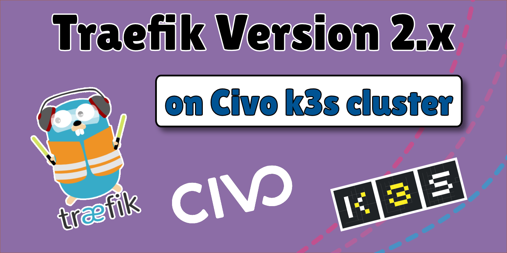

# Use **Traefik 2.x** with automatic **Let's Encrypt** with your **k3s** cluster on **Civo**

**Traefik** is a reliable reverse proxy for your cloud workloads. Even the lightweight Kubernetes distribution **k3s** is installing **Traefik** as the default reverse proxy and ingress controller to the cluster. 
However, the Traefik version used with the k3s install is still **v1.7.14**. It works fine but is missing some useful functions. The function I missed most is the automatic generation of **Let's Encrypt** certificates for the ingress routes we are using. 

The good news: With **Version 2** of **Traefik** we get this function, and much more, back. Let's see how we can setup and use the new Traefik version with **k3s**.

The goal is to setup a new k3s cluster, install Traefik version 2 and configure some Ingresses which are protected with Let's Encrypt certificates automagically.

Here are the steps we will take:
- [ ] Create a extrasmall k3s cluster on Civo 
- [ ] Point our domain (I use my dummy domain `celleri.ch`) to the cluster IP
- [ ] Install **Klipper LB** as our LoadBalancer
- [ ] Install **Traefik v2** onto the cluster 
- [ ] Deploy a small workload (whoami) to the cluster 
- [ ] Create an **Traefik** ingress to the service (with and without TLS termination) 
- [ ] Use **Traefik Middleware** to reach the **Traefik Dashboard** with Basic Authentication 

## read the [Blog post with the details](https://www.cellerich.ch/2020/02/16/use-traefik-2-x-with-automatic-lets-encrypt-with-your-k3s-cluster-on-civo/)
