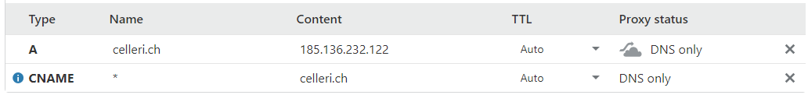
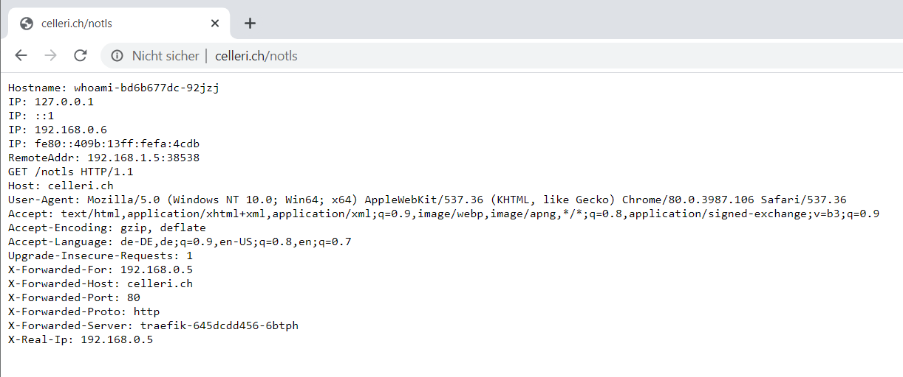
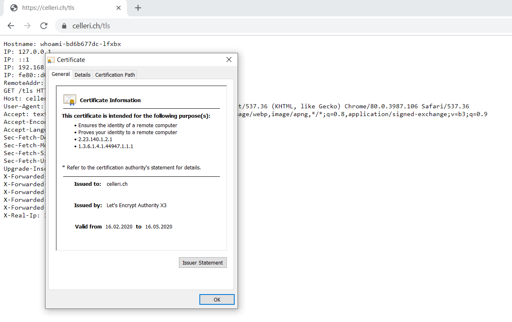
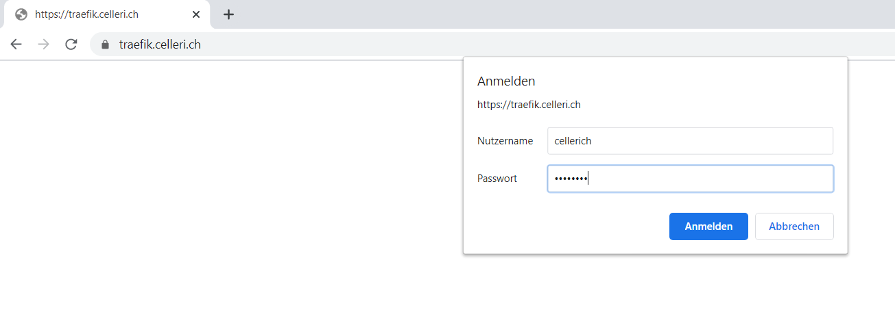
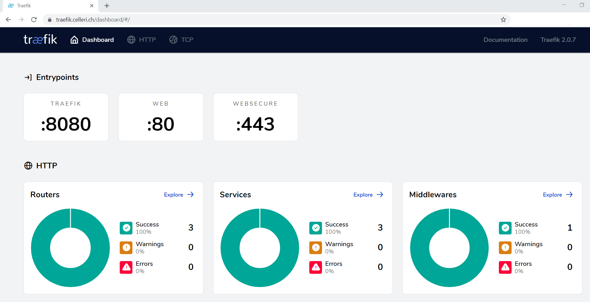
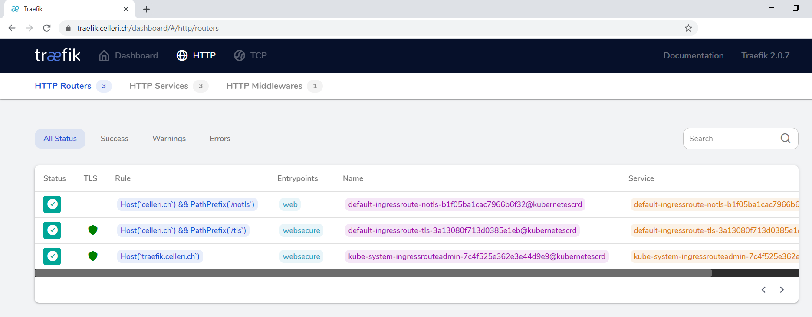

# Use **Traefik 2.x** with automatic **Let's Encrypt** with your **k3s** cluster on **Civo**

**Traefik** is a reliable reverse proxy for your cloud workloads. Even the lightweight Kubernetes distribution **k3s** is installing **Traefik** as the default reverse proxy and ingress controller to the cluster. 
However, the Traefik version used with the k3s install is still **v1.7.14**. It works fine but is missing some useful functions. The function I missed most is the automatic generation of **Let's Encrypt** certificates for the ingress routes we are using. 

The good news: With **Version 2** of **Traefik** we get this function, and much more, back. Let's see how we can setup and use the new Traefik version with **k3s**.

The goal is to setup a new k3s cluster, install Traefik version 2 and configure some Ingresses which are protected with Let's Encrypt certificates automagically.


Here are the steps we will take:
- [ ] Create a extrasmall k3s cluster on Civo 
- [ ] Point our domain (I use my dummy domain `celleri.ch`) to the cluster IP
- [ ] Install **Klipper LB** as our LoadBalancer
- [ ] Install **Traefik v2** onto the cluster 
- [ ] Deploy a small workload (whoami) to the cluster 
- [ ] Create an **Traefik** ingress to the service (with and without TLS termination) 
- [ ] Use **Traefik Middleware** to reach the **Traefik Dashboard** with Basic Authentication 


## Create Civo cluster 

Head over to [**Civo**](https://civo.com) and create an extra small cluster with only 2 nodes for this purposes. If you dont have an account yet, sign up and apply for the **KUBE100 beta** program to use their Kubernetes offering. It's a very friendly crowd and helpful and responsive (even on Sundays) on their Slack channel.

> Make sure that we **do not** install **Traefik** with the base setup!
> Just unselect **Traefik** unter the **Architecture** tab 

After 2 minutes or less we will get the following cluster:


Next we note down the IP-address of our master node and download the `kubeconfig` file. In our case it's named `civo-k3s-with-traefik2-kubeconfig` since we named the cluster **k3s-with-traefik2**. To access the cluster from our command line with `kubectl` we need to point the environment variable towards the config file and change the context to our new cluster.

```bash
# set env variable with new cluster config
export KUBECONFIG=./civo-k3s-with-traefik2-kubeconfig
kubectl config use-context k3s-with-traefik2

#check the available nodes
kubectl get nodes

NAME               STATUS   ROLES    AGE     VERSION
kube-master-de56   Ready    master   9m15s   v1.16.3-k3s.2
kube-node-40e7     Ready    <none>   7m21s   v1.16.3-k3s.2
``` 

As we can see, our new cluster with a master and a worker node is ready! Let's move on.

## Point the domain `celleri.ch` to the new cluster ip address 

Since a while back I am using the DNS Services of [**Cloudflare**](https://www.cloudflare.com/dns/) to play around with all this new Kubernetes stuff. It's very reliable, has a nice user interface and the basic service I use comes free of charge. A big **thank you Cloudflare** for this!

In Cloudflare we apply the following settings: 


For this example we dont want to create a CNAME entry for every subdomain we might use, therefore we create a wildcard (*) entry as a CNAME here. Traefik will make sure to route the traffic to tzhe right place later.

## Install **Klipper LB** as our LoadBalancer

The Kubernetes distribution from **k3s** is installed with **Traefik V1.7.x** as a default. The default installation is also deploying a internal **LoadBalancer** from Rancher called [**Klipper LB**](https://github.com/rancher/klipper-lb). Since we opted out of the Traefik installation while setting up the cluster, we have to install Klipper LB manually ourselfes now.

Klipper will hook itself onto the Host Ports of our cluster nodes and will use the Ports 80, 443 and 8080.

You will find all the files I mention here in my [**GitHub Repo** - k3s-with-traefik](https://github.com/cellerich/k3s-with-traefik2).

```bash
# install KlipperLB
kubectl apply -f 00-klipper-lb/klipper.yaml

# see if klipper hooked up to the host ports and is working
kc get pods --all-namespaces | grep svclb
kube-system  svclb-traefik-gc8lg     3/3     Running   0          96s
kube-system  svclb-traefik-pqbzb     3/3     Running   0          96s
``` 

The pods seem to work with 3 containers (one for each host port) running inside them. Let's move on and install **Traefik Version 2**!

## Install **Traefik v2** into the cluster 

**Traefik Version 2** comes with a lot of CRD's (Custom Resource Definitions). This seems to be the new and approved way to extend Kubernetes objects. I have not wrapped my head around them to the full extent, but let's use the anyway. They seem to work. You find the right `yaml` files in the [Traefik Documentation](https://docs.traefik.io/v2.0/user-guides/crd-acme/) or you can use my `01-traefik-crd/traefik-crd.yaml` file provided in the [GitHub Repo](https://github.com/cellerich/k3s-with-traefik2)

```bash
# apply traefik crd's
kubectl apply -f 01-traefik-crd/traefik-crd.yaml
``` 
This command should create 5 `customresourcedefinition`'s.

To let **Traefik** do what it needs to do, we also need a `clusterrole` and a `clusterrolebinding`. We can apply this with:

```bash
# apply clusterrole and clusterrolebinding
kubectl apply -f 01-traefik-crd/traefik-clusterrole.yaml
``` 

>Notice that we do the `clusterrolebinding` for the `ServiceAccount` in the namespace `kube-system` since we will install traffic into this namespace later!

```yaml
kind: ClusterRoleBinding
apiVersion: rbac.authorization.k8s.io/v1beta1
metadata:
  name: traefik-ingress-controller

roleRef:
  apiGroup: rbac.authorization.k8s.io
  kind: ClusterRole
  name: traefik-ingress-controller
subjects:
  - kind: ServiceAccount
    name: traefik-ingress-controller
    namespace: kube-system
``` 

Finally we are able to deploy the **Traefik** `Service`, `ServiceAccount` and `Deployment` to the cluster:

```bash
kubectl apply -f 02-traefik-service/traefik.yaml
``` 

This should leave us with a Service of type LoadBalancer with the external address of the master node of our cluster:

```bash
# get traefik service
kubectl get svc -n kube-system | grep traefik

traefik          LoadBalancer   192.168.211.177   185.136.232.122   80:32286/TCP,443:30108/TCP,8080:30582/TCP   3m43s
``` 

## Deploy a small workload (whoami) to the cluster 

Now it's time to create a service in our cluster and try to call it from the big world outside trough our **Traefik** proxy. For this example we are using the **whoami** service which is used in all the examples of the Traefik documentation as well. Let's deploy it:

```bash  
# deploy `whoami` in namespace `default`
kubectl apply -f 03-workload/whoami-service.yaml

#check the deployment 
kubectl get pods | grep whoami

whoami-bd6b677dc-lfxbx   1/1     Running   0          5m37s
whoami-bd6b677dc-92jzj   1/1     Running   0          5m37s
``` 

Seems to work. Now on to the exiting part, the **Traefik Ingress**...

## Create two **Traefik** ingresses to the service (with and without TLS termination) 

We want to access the `whoami` service from the outside, so we can finally define the `IngressRoute` objects. Yes, those objects were defined in the CRD's we installed earlier. Now they comein handy. We deploy the `IngressRoutes` as follows:

```bash
kubectl apply -f 03-workload/whoami-ingress-route.yaml
``` 

As you can see in the definition we have one route (with PathPrefix '/tls') specified with a `tls.certResolver=default`. This `certResolver` is defined in our `02-traefik-service/traefik.yaml` file. But we look into this in a moment.

```yaml
apiVersion: traefik.containo.us/v1alpha1
kind: IngressRoute
metadata:
  name: ingressroute-notls
  namespace: default
spec:
  entryPoints:
    - web
  routes:
    - match: Host(`celleri.ch`) && PathPrefix(`/notls`)
      kind: Rule
      services:
        - name: whoami
          port: 80

---
apiVersion: traefik.containo.us/v1alpha1
kind: IngressRoute
metadata:
  name: ingressroute-tls
  namespace: default
spec:
  entryPoints:
    - websecure
  routes:
    - match: Host(`celleri.ch`) && PathPrefix(`/tls`)
      kind: Rule
      services:
        - name: whoami
          port: 80
  tls:
    certResolver: default
``` 

Now start the browser and see what will happen on the address `http://celleri.ch/notls`. Yes the pod is answering:



What about `https://celleri.ch/tls`. It works as well, but tells us first the connection is not safe. If we look at the certificate we see why:


As a precaution to not get locked out of Let's Encrypt because we hit the production server with to many requests in case our setup does not work, we used the staging server in our **Traefik Service**. Let's change that and use the production server to get a real certificate.

## Change the `certResolver` to use the Let'Encrypt production server

In our definition of the **Traefik Deployment** we have the following arguments:

```yaml
    ... cropped for readability ...

    spec:
      serviceAccountName: traefik-ingress-controller
      containers:
        - name: traefik
          image: traefik:v2.0
          args:
            - --api.insecure
            - --accesslog
            - --entrypoints.web.Address=:80
            - --entrypoints.websecure.Address=:443
            - --providers.kubernetescrd
            - --certificatesresolvers.default.acme.tlschallenge
            - --certificatesresolvers.default.acme.email=me@myself.com
            - --certificatesresolvers.default.acme.storage=acme.json
            # Please note that this is the staging Let's Encrypt server.
            - --certificatesresolvers.default.acme.caserver=https://acme-staging-v02.api.letsencrypt.org/directory

    ... cropped for readability ...
``` 

We tell **Traefik** to use the `certificatesresolvers` with the name `default` with the `tlschallange` method. Further we provide our email and the `storage` for the certificates. And we also mention that we want to use the staging `caserver`.

> **Important**: In our deployment we have no storage provider or volume. This means, that our certificates will vanish as soon as our deployment is reloaded. The certificates live only in the memory of our pods. In production environments we have to adress this and provide a volume! 

Ok, let's comment out the `caserver` line and redeploy our **Traefik** deployment to see if we get a real certificate:

```yaml
    ... cropped for readability ...

    spec:
      serviceAccountName: traefik-ingress-controller
      containers:
        - name: traefik
          image: traefik:v2.0
          args:
            - --api.insecure
            - --accesslog
            - --entrypoints.web.Address=:80
            - --entrypoints.websecure.Address=:443
            - --providers.kubernetescrd
            - --certificatesresolvers.default.acme.tlschallenge
            - --certificatesresolvers.default.acme.email=me@myself.com
            - --certificatesresolvers.default.acme.storage=acme.json
            # Please note that this is the staging Let's Encrypt server.
            # - --certificatesresolvers.default.acme.caserver=https://acme-staging-v02.api.letsencrypt.org/directory

    ... cropped for readability ...
``` 
```bash
# deploy the changed file
kubectl apply -f 02-traefik-service/traefik.yaml
``` 
And after a while we get a valid certificate - Great!



After this, we could lean back, open a beer and be happy with the result. But we want to go a step further. **Traefik Version 2** has also a nice Dashboard to look at all the Ingress stuff going on. But we dont want everybody in public to be able to access our Dashboard just like that. Some basic authentication would be nice...

## Use **Traefik Middleware** to reach the **Traefik Dashboard** with Basic Authentication

**Traefik** gets us covered here as well! They introduced a new [term called **Middleware**](https://docs.traefik.io/v2.0/middlewares/overview/) which helps us with a lot of tasks when it comes to handle incoming requests. We will use the **basicAuth Middleware** to protect and expose our **Traefik Dashboard** to the outside world.

First we need to create a **Secret** with our username and password hash for the basicAuth Middleware to pick up later:

```bash
# create user:password file 'user'
htpasswd -c ./user cellerich

# enter password twice...

# create secret from password file 
kubectl create secret generic traefik-admin --from-file user -n kube-system
``` 
>Make sure to create the **Secret** in the namespace `kube-system` since **Traefik Service** and it's Dashboard lives in this namespace as well!

Then we deploy the **Middleware** and the **IngressRoute** to our cluster:

```bash
kubectl apply -f 04-traefik-dashboard/traefik-admin-withauth.yaml
``` 
Now we head over to `https://traefik.celleri.ch` and are greeted with a login prompt:



With the right credentials we will get the nice **Traefik Version 2 Dashboard**:



And we can get a lot of information about our Ingress Routes:



## Final thoughts

That's it. On my research for this journey I did not find that many examples on how to setup **Traefik Version 2** within *k3s*. Especially the part with **Klipper LB** was never mentioned. That's why I like to share my experience with the great community out there.
Hope it helps somebody, at least it will help my future self to find the info again later.


## Links to resources around this blog post.

### The files for this project are hosted on my GitHub Account
- [k3s cluster with Traefik version 2](https://github.com/cellerich/k3s-with-traefik2)

### Links to the products and services mentioned in the blogpost

- Apply to join the [**Civo KUBE100 beta**](https://www.civo.com/kube100)
- Containous the makers of [**Traefik** have a product page](https://containo.us/traefik/)
- The [product page of Rancher's **k3s**](https://k3s.io/)
- [**Cloudflare** DNS services](https://www.cloudflare.com/dns/)
- Rancher's [**Klipper LB**](https://github.com/rancher/klipper-lb)

### Links to useful product documentations

- Full example of [Traefik with Let's Encrypt](https://docs.traefik.io/v2.0/user-guides/crd-acme/)
- [Traefik Middleware](https://docs.traefik.io/v2.0/middlewares/overview/)

